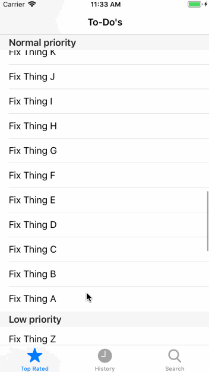

# BLResultsController [](#installation) [](#license)

[](#installation)
[](#swift-versions-support)
[](https://cocoapods.org/pods/BLResultsController)
[](https://github.com/Carthage/Carthage)
[](http://twitter.com/BellAppLab)


Contrary to popular belief, BLResultsController is **not** a drop-in replacement for the `NSFetchedResultsController` to be used with Realm. Oh no. It's _better_.

A `ResultsController` takes a `Realm.Results` and divides its objects into sections based on the `sectionNameKeyPath` and the first `sortDescriptor`. It then calculates the relative positions of those objects and generates section indices and `IndexPath`s that are ready to be passed to `UITableView`s and `UICollectionView`s.

But **no expensive calculations are made on the main thread**. That's right. Everything is done in the background, so your UI will remain as smooth and responsive as always. 

As with `Realm.Results`, the `ResultsController` is a live, auto-updating container that will keep notifying you of changes in the dataset for as long as you hold a strong reference to it. You register to receive those changes by calling `setChangeCallback(_:)` on your controller.

Changes to the underlying dataset are calculated on a background queue, therefore the UI thread is not impacted by the `ResultsController`'s overhead.

**Note**: As with `Realm` itself, the `ResultsController` is **not** thread-safe. You should only call most of its methods from the main thread.

## Features

- [X] Calculates everything on a **background thread**. 🏎
- [X] No objects are retained, so memory footprint is minimal. 👾
- [X] Calculates section index titles. 😲
- [X] Allows for user-initiated search. 🕵️‍♀️🕵️‍♂️
- [X] Most methods return in O(1). 😎
- [X] Well documented. 🤓
- [X] Well tested. 👩‍🔬👨‍🔬

## Specs

* RealmSwift 3.0.0+
* iOS 9+
* tvOS 10+
* macOS 10.10+
* Swift 4.0+

`BLResultsController` also uses the amazing [BackgroundRealm](https://github.com/BellAppLab/BackgroundRealm). Have a look!

## Example



```swift
import UIKit
import RealmSwift
import BLResultsController

class ViewController: UITableViewController {
    let controller: ResultsController<<#SectionType#>>, <#ElementType#>> = {
        do {
            let realm = <#instantiate your realm#>
            let keyPath = <#the key path to your Element's property to be used as a section#>
            return try ResultsController(
                realm: realm,
                sectionNameKeyPath: keyPath,
                sortDescriptors: [
                    SortDescriptor(keyPath: keyPath)
                ]
            )
        } catch {
            assertionFailure("\(error)")
            //do something about the error
        }
    }()

    override func viewDidLoad() {
        super.viewDidLoad()

        controller.setChangeCallback { [weak self] change in
            switch change {
            case .reload(_):
                self?.tableView.reloadData()
            case .sectionUpdate(_, let insertedSections, let deletedSections):
                self?.tableView.beginUpdates()
                insertedSections.forEach { self?.tableView.insertSections($0, with: .automatic) }
                deletedSections.forEach { self?.tableView.deleteSections($0, with: .automatic) }
                self?.tableView.endUpdates()
            case .rowUpdate(_, let insertedItems, let deletedItems, let updatedItems):
                self?.tableView.beginUpdates()
                self?.tableView.insertRows(at: insertedItems, with: .automatic)
                self?.tableView.deleteRows(at: deletedItems, with: .automatic)
                self?.tableView.reloadRows(at: updatedItems, with: .automatic)
                self?.tableView.endUpdates()
            }
        }
        
        controller.setFormatSectionIndexTitleCallback { (section, _) -> String in
            return section
        }
        
        controller.setSortSectionIndexTitles { (sections, _) in
            sections.sort(by: { $0 < $1 })
        }

        controller.start()
    }

    override func numberOfSections(in tableView: UITableView) -> Int {
        return controller.numberOfSections()
    }

    override func tableView(_ tableView: UITableView,
                            numberOfRowsInSection section: Int) -> Int
    {
        return controller.numberOfItems(in: section)
    }

    override func tableView(_ tableView: UITableView,
                            cellForRowAt indexPath: IndexPath) -> UITableViewCell
    {
        guard let cell = tableView.dequeueReusableCell(withIdentifier: <#identifier#>) else {
            fatalError("Did we configure the cell correctly on IB?")
        }
        <#code#>
        return cell
    }
    
    override func tableView(_ tableView: UITableView,
                            titleForHeaderInSection section: Int) -> String?
    {
        return controller.section(at: section)
    }
    
    override func sectionIndexTitles(for tableView: UITableView) -> [String]? {
        return controller.indexTitles()
    }
    
    override func tableView(_ tableView: UITableView,
                            sectionForSectionIndexTitle title: String,
                            at index: Int) -> Int
    {
        return controller.indexPath(forIndexTitle: title).section
    }
}
```

Boom 💥

## Installation

### Cocoapods

```ruby
pod 'BLResultsController', '~> 1.0'
```

Then `import BLResultsController` where needed.

### Carthage

```swift
github "BellAppLab/BLResultsController" ~> 1.0
```

Then `import BLResultsController` where needed.

### Git Submodules

```shell
cd toYourProjectsFolder
git submodule add -b submodule --name BLResultsController https://github.com/BellAppLab/BLResultsController.git
```

Then drag the `BLResultsController` folder into your Xcode project.

## Author

Bell App Lab, apps@bellapplab.com

### Contributing

Check [this out](./CONTRIBUTING.md).

### Credits

[Logo image](https://thenounproject.com/search/?q=controller&i=316262#) by [Andres Flores](https://thenounproject.com/aflores158) from [The Noun Project](https://thenounproject.com/)

## License

BLResultsController is available under the MIT license. See the LICENSE file for more info.
